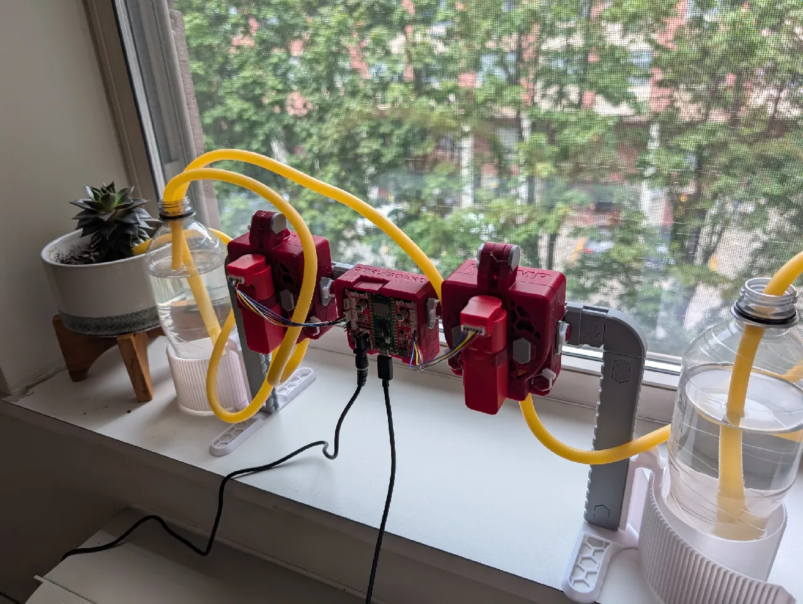

# AgXRP Kit — Setup & User Guide

Welcome to the AgXRP Setup & User Guide. This documentation will walk you through everything you need to get your AgXRP plant monitoring and automated watering kit up and running.

## What's in This Guide

| Tutorial / Appendix | Description |
|---|---|
| [Tutorial 1](tutorial-1-software-setup.md) | Kit Contents, Assembly & Wiring |
| [Tutorial 2](tutorial-2-dashboard-and-configuration.md) | Dashboard, Watering Controller & Configuration |
| [Tutorial 3](tutorial-3-additional-sensors-and-pumps.md) | Additional Sensors & Pumps |
| [Tutorial 4](tutorial-4-pump-calibration.md) | Pump Calibration |
| [Tutorial 5](tutorial-5-moisture-sensor-calibration.md) | Moisture Sensor Calibration |
| [Tutorial 6](tutorial-6-plant-experiment.md) | Running Your Plant Experiment |
| [Appendix i](appendix-i-soil-drying.md) | Soil Drying Steps |
