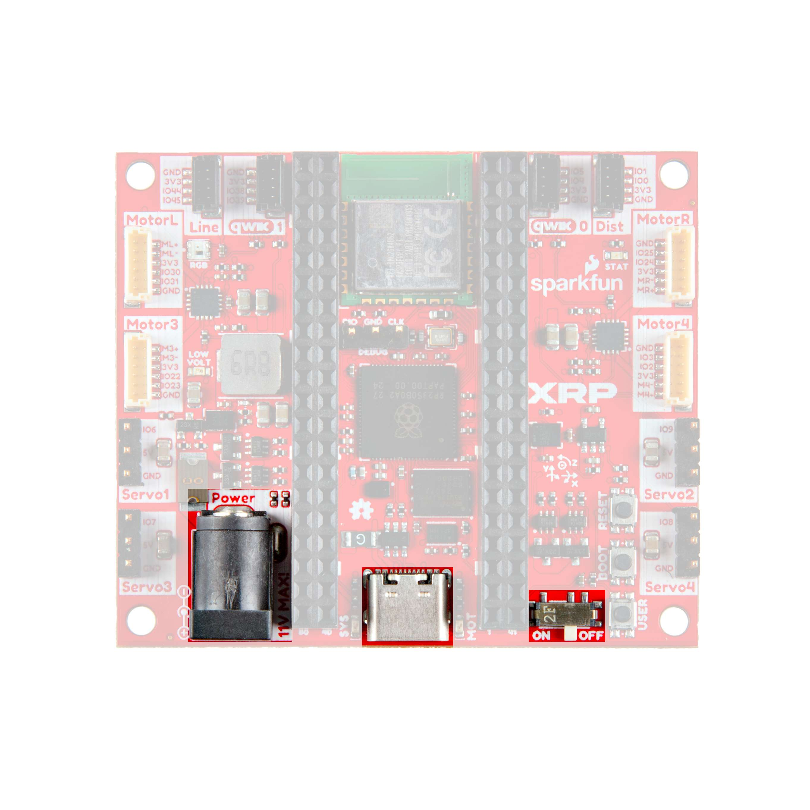
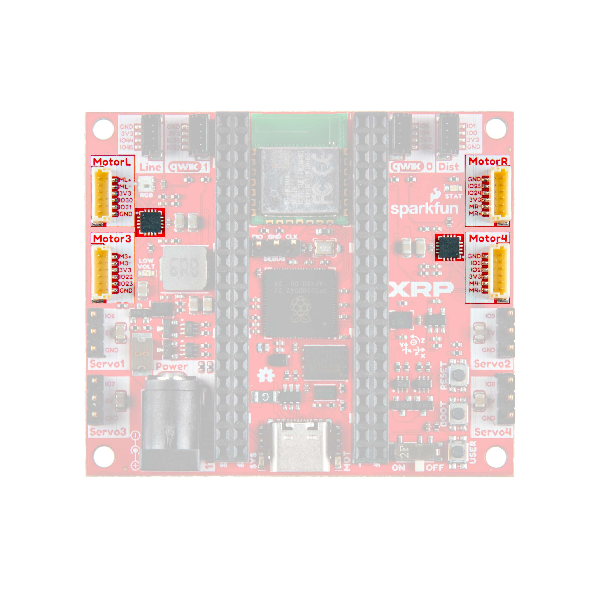
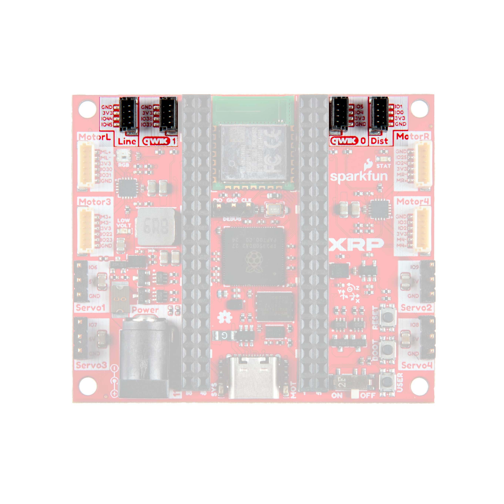

# Tutorial 1 — Kit Contents, Assembly & Wiring

This tutorial covers everything that comes with the AgXRP kit, how to assemble it, and how to connect the wires and sensors. By the end, your AgXRP will be fully assembled and ready to power on.

## What Comes with the Kit

Your AgXRP kit includes the following items:

| Component | Quantity | Description |
|-----------|----------|-------------|
| [XRP Control Board](https://docs.sparkfun.com/SparkFun_XRP_Controller/hardware_overview/) | 1 | The Raspberry Pi Pico W-based brain of the AgXRP. Pre-loaded with web server firmware. |
| Encoded motor (peristaltic pump) | 1 | A motor-driven pump that pushes water through silicone tubing. |
| [Capacitive soil moisture sensor](https://www.sparkfun.com/sparkfun-qwiic-soil-moisture-sensor-capacitive.html) | 1 | A qwiic-compatible sensor that measures soil moisture without corroding over time. |
| 9V power supply with barrel jack | 1 | Powers the XRP board. |
| 3D-printed parts | — | Housing for the control board, pump mount, and bottle holder. |
| Qwiic cable | 1 | For connecting the soil moisture sensor to the board. |
| Motor cable | 1 | For connecting the pump to the board. |
| Silicone tubing | 1 | Fits inside the peristaltic pump for water delivery. |

!!! note
    The AgXRP platform supports additional sensors and pumps beyond what is included in the base kit. See [Tutorial 3](tutorial-3-additional-sensors-and-pumps.md) for information on expanding your setup.

---

## Assembly

The AgXRP uses 3D-printed parts to hold the control board, pump, and water bottle in place. A video walkthrough of the full assembly process is available here:

**[Watch the Assembly Video](______________________)**

!!! warning "Author Note"
    The YouTube video link has been left blank intentionally. Fill in the URL before distributing this guide.

In short, the assembly involves mounting the XRP control board into the 3D-printed housing, attaching the pump to its mount, and securing the water bottle holder. Follow the video for step-by-step visual instructions.

---

## Wires and Connectors

Once the 3D-printed parts are assembled, you need to connect the power supply, pump, and soil sensor to the XRP board. This section walks through each connection.

!!! warning "Power Off First"
    Before connecting any wires, make sure the board is **not connected to power**.

### Power

The AgXRP is powered by a **9V barrel jack** power supply (included with the kit).

1. Plug the barrel jack connector from the power supply into the **barrel jack port** on the XRP board.
2. Flip the **power switch** to the **ON** position.

*XRP board showing the barrel jack port and power switch*

!!! tip
    The power switch is a small sliding switch near the barrel jack. When the switch is in the ON position, the board will boot up and the web server will start automatically.

---

### Motor Ports

The XRP board has **4 motor ports** for connecting peristaltic pumps. Any of the four ports can be used — which port maps to which pump number is configured in software through the web interface.

1. Connect the motor cable from the pump to motor port number 1. While any of the motors ports can be configure to work, the sofware defaults to port 1.

*XRP board showing the four motor ports*

!!! tip
    Make sure the pins on the wire connector align with the holes in the port before pressing in. Do not force the connector — it should slide in smoothly.

!!! note
    The base kit includes one pump. If you add more pumps later (up to 4 total), connect each one to a different motor port. See [Tutorial 3](tutorial-3-additional-sensors-and-pumps.md) for details.

---

### Qwiic Connectors (Sensors)

The XRP board has **two qwiic connector ports** on the top of the board, labeled **qwiic 0** and **qwiic 1**. These small four-pin connectors are used to connect the soil moisture sensor (and any additional sensors you add later).

1. Connect the qwiic cable from the soil moisture sensor to **either** the **qwiic 0** or **qwiic 1** port on the board.
2. Remember which port you used — you will need to tell the AgXRP which port the sensor is connected to on the Configuration page (this is called the **I2C bus** number: qwiic 0 = Bus 0, qwiic 1 = Bus 1).

*XRP board showing qwiic 0 and qwiic 1 ports*

!!! note
    The board also has **line sensor** and **distance sensor** ports. These are **not used** by the AgXRP and can be ignored.

!!! note
    Each qwiic port corresponds to an **I2C bus**: qwiic 0 = Bus 0, qwiic 1 = Bus 1. The soil moisture sensor has two qwiic connectors on it — use either one to connect to the board. The second connector on the sensor can be used later to daisy-chain additional sensors (see [Tutorial 3](tutorial-3-additional-sensors-and-pumps.md)).

---

## Powering On

Once everything is connected:

1. Make sure the barrel jack power supply is plugged in.
2. Flip the power switch to **ON**.
3. The board will boot up and automatically start the AgXRP web server. No code to upload and no buttons to press.

You are now ready to connect to the AgXRP from your phone or computer. Continue to [Tutorial 2](tutorial-2-dashboard-and-configuration.md) to learn how to use the web interface.

---

## Reflashing the Firmware (If Needed)

Your AgXRP board comes with the web server firmware **already installed**. You should never need to upload code during normal use.

If you ever need to reinstall or update the firmware (for example, after a factory reset or to install a newer version), follow the reflashing guide at:

**[xrpcode.wpi.edu](https://xrpcode.wpi.edu)**

!!! note
    Reflashing requires a USB-C cable to connect the board to your computer. You do not need a USB-C cable for normal operation.

---

## Next Steps

- Proceed to [Tutorial 2 — Dashboard & Configuration](tutorial-2-dashboard-and-configuration.md) to connect to the web interface and learn how to monitor your sensors and control your pump.
