# Tutorial 2 — How the AgXRP Works

This tutorial explains how the AgXRP system works as a whole: how it communicates wirelessly, how sensors and devices connect, how pumps are controlled, and how data is recorded over time. By the end, you will have a clear mental model of every major part of the system and know how to configure each one.

!!! note "Before You Begin"
    Make sure you have completed [Tutorial 1 — Kit Contents, Assembly & Wiring](tutorial-1-software-setup.md) and that your AgXRP is powered on.

---

## How It All Fits Together

Before diving into the details, here is the big picture. The AgXRP is a self-contained plant monitoring and automatic watering system built around the XRP microcontroller board. Think of it as a small computer dedicated entirely to watching your plants and keeping them watered.

The system has four main parts that all work together:

- **The XRP board** — the brain of the system. It reads sensors, controls pumps, hosts a website, and logs data.
- **Sensors** — devices that plug into the board and measure things like soil moisture. The board reads them continuously and reports their values.
- **Pumps** — small motors that push water through a tube to your plants. The board can run them automatically or let you control them manually.
- **The web interface** — a website hosted by the board itself. You connect to it from your phone, tablet, or laptop to see sensor data, control pumps, and change settings.

*The AgXRP system: the XRP board connects to sensors and pumps directly, and communicates with your devices over Wi-Fi.*

Everything in this tutorial builds on this picture. When you understand how each piece fits in, the rest of the details fall into place.

---

## Wi-Fi

### How the AgXRP Creates Its Own Network

The XRP board has a built-in Wi-Fi radio. Rather than connecting to your home or school Wi-Fi network, the AgXRP creates its own dedicated Wi-Fi network — called a **hotspot** or **access point** — that your phone, tablet, or laptop can connect to directly.

This is an important concept: the AgXRP is not on the internet. It is its own private network. When you connect your device to the AgXRP's Wi-Fi, your device and the board are the only things on that network.

The default network name and password are:

- **Network name (SSID):** `AgXRP_SensorKit`
- **Password:** `sensor123`

### Connecting for the First Time

1. Power on your AgXRP and wait about 15 seconds for it to finish starting up.
2. On your phone, tablet, or laptop, open your Wi-Fi settings.
3. Look for the network named `AgXRP_SensorKit` and connect to it using the password `sensor123`.
4. Open a web browser and go to: **http://192.168.4.1**

The AgXRP dashboard should load in your browser.

!!! note "No Internet While Connected"
    While your device is connected to the AgXRP's Wi-Fi network, it will not have access to the internet. This is expected — the AgXRP creates its own local network and does not connect to the broader internet. To get internet access back, simply switch your device back to your regular Wi-Fi network.

!!! tip "The Page May Open Automatically"
    On some phones and tablets, a browser window will pop up automatically when you join a new Wi-Fi network. If that happens, you are already on the right page. If it does not, just open your browser and type in the address above.

### The Three Pages of the Web Interface

Once you are connected, the AgXRP web interface has three pages. You can switch between them using the navigation links at the top of any page.

| Page | Address | What It Does |
|------|---------|--------------|
| **Dashboard** | `http://192.168.4.1` | Shows live sensor readings, manual pump controls, and the automatic watering controller. This is the main page you will use day-to-day. |
| **Configure** | `http://192.168.4.1/configure` | Lets you change every setting on the device — sensors, pumps, Wi-Fi, logging, and more. Changes take effect after saving and rebooting. |
| **Data** | `http://192.168.4.1/data` | Lets you view and download the CSV log files stored on the board. |

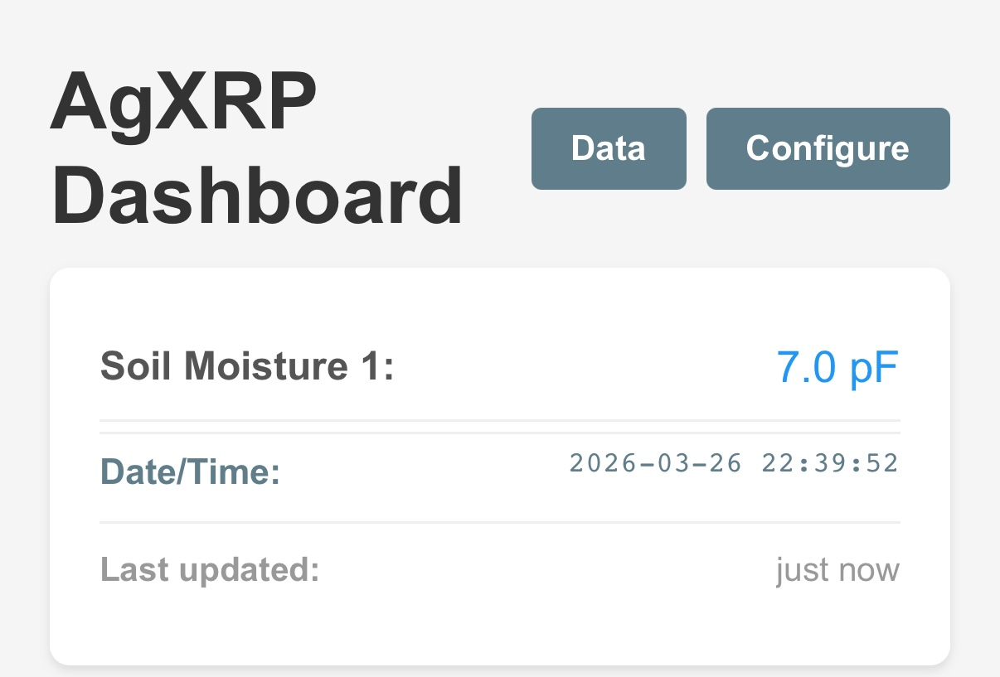
*The top of the Dashboard page. The navigation links to Dashboard, Data, and Configure appear in the header.*

### Using Multiple AgXRP Kits in the Same Room

Because every AgXRP ships with the same default network name (`AgXRP_SensorKit`), having more than one powered on in the same room will cause a conflict — your device won't know which board to connect to.

The solution is to give each AgXRP a unique network name before running them together. You can do this on the **Configuration page**.

### Changing the Wi-Fi Network Name and Password

Navigate to **http://192.168.4.1/configure** and find the **Access Point** section near the top of the page.

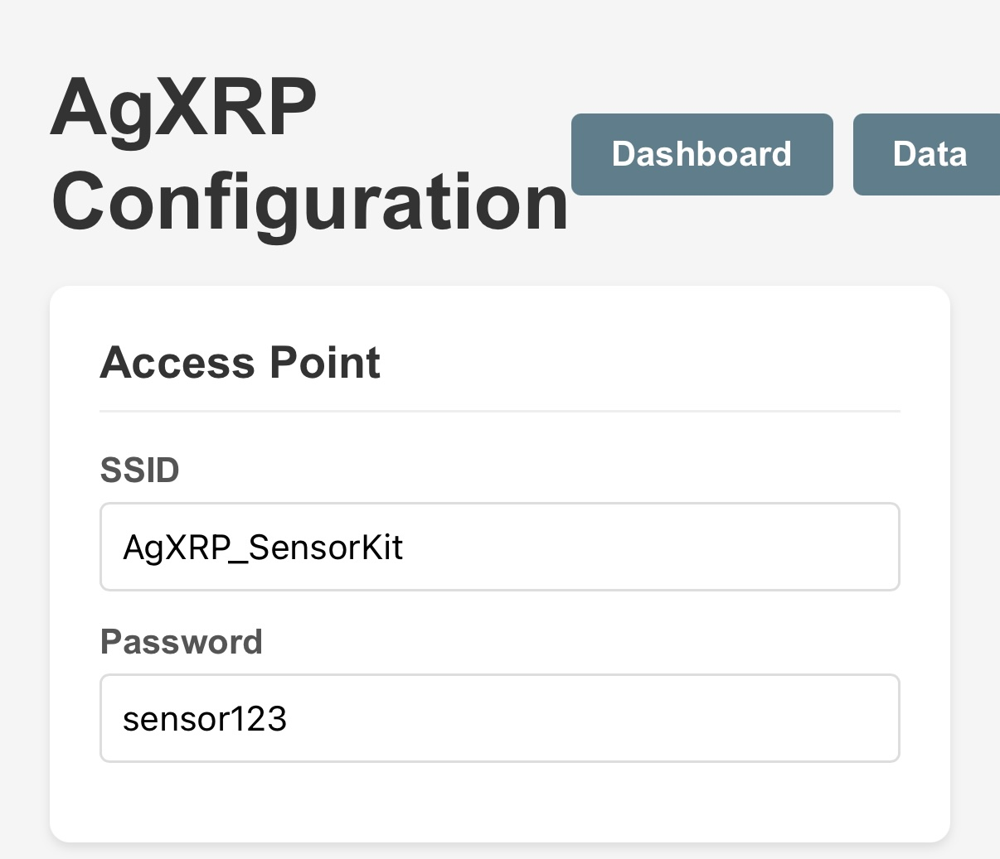
*The Access Point section of the Configuration page.*

| Field | What to Change |
|-------|----------------|
| **SSID** | The network name. Change this to something unique if you have multiple kits (e.g., `AgXRP_Bench1`, `AgXRP_Bench2`). |
| **Password** | The Wi-Fi password. Must be at least 8 characters. |

After making changes, scroll to the bottom and click **Save Configuration**, then **Reboot to Apply Changes**. Once the board restarts, reconnect your device to the new network name.

!!! warning
    After changing the SSID, the old network name will disappear. Make a note of your new name and password before rebooting.

---

## Sensors and Devices

### About Qwiic Sensors and I2C

All of the sensors and devices that connect to the AgXRP use a communication standard called **I2C** (pronounced "I-squared-C") over a type of cable called a **Qwiic cable**. You don't need to know the technical details of I2C to use the AgXRP, but understanding one key concept will help you avoid problems: **each device on a shared bus must have a unique address**.

Here is what that means in practice:

The XRP board has two Qwiic ports, labeled **Qwiic 0** and **Qwiic 1**. Each port is connected to its own **I2C bus** — think of a bus as a shared communication channel, like a hallway that multiple devices can talk through. Multiple sensors can share the same bus (the same hallway), but each one must have a different "name" (address) so the board knows who it is talking to.

This matters because most sensors come from the factory with a fixed address. If you plug two of the same sensor into the same bus, they both have the same address and the board cannot tell them apart. The solution is simple: **plug each sensor into a different Qwiic port** (one on Bus 0, one on Bus 1), so each one has its own private channel to the board.

*Left: Two sensors on separate buses — works correctly. Right: Two identical sensors on the same bus — causes an address conflict.*

### Enabling the I2C Buses

For the board to communicate with sensors on a given port, that port's bus must be enabled in the configuration. On the **Configuration page**, find the **I2C Bus Configuration** section.

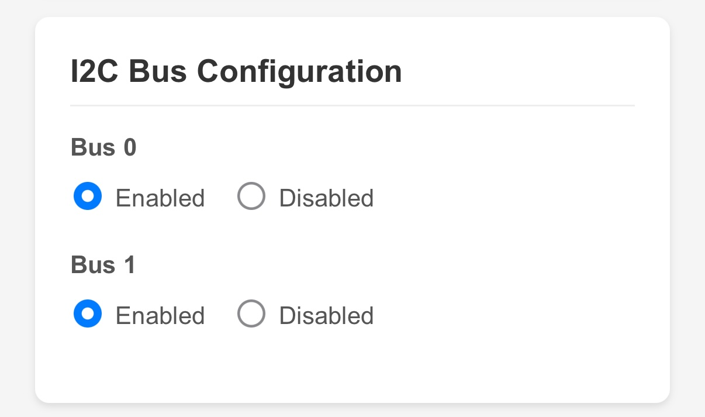
*The I2C Bus Configuration section. Enable only the buses that have sensors connected.*

- **Bus 0** corresponds to the **Qwiic 0** port.
- **Bus 1** corresponds to the **Qwiic 1** port.

Enable a bus if you have a sensor or device plugged into that port. If a port is empty, you can leave its bus disabled.

!!! tip
    The base kit comes with one soil moisture sensor. The default configuration has both buses enabled. As long as the sensor is plugged into either Qwiic port, it should work without any changes here.

### How Sensors Report Data

Once a sensor is connected and its bus is enabled, the board reads it on a regular schedule and displays the latest value on the Dashboard. You can control how often this happens with the **Sensor Update Interval** setting on the Configuration page.

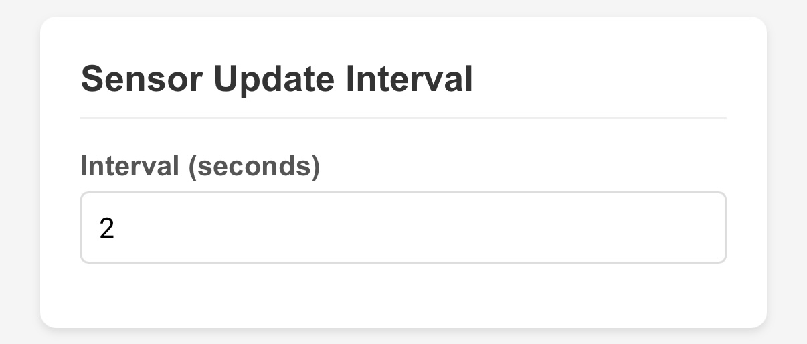
*The Sensor Update Interval field. Set this to 2 seconds or higher.*

The default is **2 seconds**, which means the Dashboard refreshes with new sensor readings every 2 seconds. Setting this too low (below 1 second) can cause the board to become unresponsive, so keep it at 2 seconds or above for normal use.

### Logging Sensor Data to a File

The AgXRP can write sensor readings to a **CSV file** stored directly on the board. CSV files can be opened in Excel, Google Sheets, or any spreadsheet application, making them ideal for tracking sensor readings over days, weeks, or even a full year of plant experiments.

CSV logging is disabled by default. To turn it on, go to the **Configuration page** and find the **Sensor CSV Logger** section.

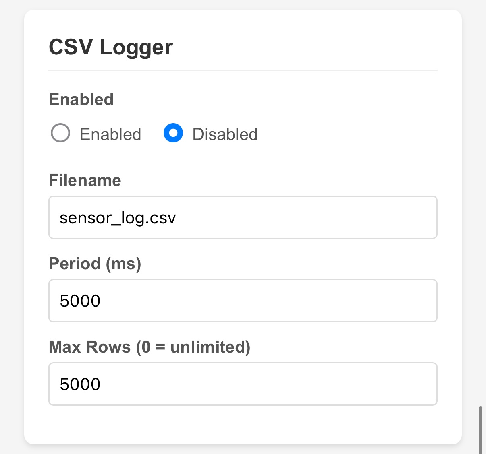
*The CSV Logger configuration section.*

| Field | Description |
|-------|-------------|
| **Enabled** | Turn logging on or off. |
| **Filename** | The name of the log file saved on the board (default: `sensor_log.csv`). |
| **Period (hours)** | How often a new row is written to the file. `1.0` means once per hour. `0.5` means every 30 minutes. |
| **Max Rows** | Once this many rows are recorded, the file rotates — the old file is renamed `.bak` and a new one starts. This prevents the file from growing until it fills the board's storage. |

**How often should you log?** The XRP board has limited onboard storage, so logging too frequently will fill it up quickly. Here are some guidelines:

- If you plan to run the AgXRP for **a full year**, log no more than once every **30–60 minutes** (`0.5` to `1.0` hours). Once per hour is a good starting point.
- If you are running a **short experiment** (a few days to a few weeks), logging every **15 minutes** (`0.25` hours) gives you more detail without filling storage.
- Logging more than once every **5 minutes** is rarely necessary and will fill storage quickly.

!!! note
    The pump also has its own separate log file that records every watering event. That is covered in the [Pumps section](#pumps) below.

### Instantaneous vs. Averaged Readings

Each sensor can be configured to log either the **current reading** at the moment of logging, or the **average** of all readings taken since the last log entry.

- **Current reading (default):** Logs exactly what the sensor reads at the moment the log entry is written.
- **Average over interval:** Logs the mathematical average of all sensor readings taken since the last log entry. This smooths out short-term fluctuations and gives a more stable picture of conditions over time.

For most plant monitoring experiments, the average is more meaningful than a single snapshot — especially if you are logging once per hour.

To configure this, go to the **Configuration page** and find the section for the sensor you want to change. Each sensor has its own **Average over interval** toggle.

*The "Average over interval" toggle on a soil sensor configuration. Set to Enabled to log averaged readings.*

---

### Capacitive Soil Moisture Sensor

The base kit comes with **one capacitive soil moisture sensor**. This sensor measures how much water is in the soil by detecting tiny changes in electrical capacitance — essentially, it detects how well the soil conducts electricity, which changes as the soil gets wetter or drier. The reading is reported in **pF (picofarads)**, a unit of electrical capacitance.

You do not need to understand the physics to use it. What matters is this: **a higher pF reading means wetter soil; a lower pF reading means drier soil.** [Tutorial 5 — Moisture Sensor Calibration](tutorial-5-moisture-sensor-calibration.md) will walk you through finding the right values for your specific soil and plant.

#### I2C Address

Every sensor has a hardware I2C address — a fixed number that identifies it on the bus. The capacitive soil sensor has a default address of `0x37`.

**You do not need to change this** unless you are running two capacitive soil sensors on the same bus (which you should avoid — use separate buses instead). The I2C address setting is on the Configuration page in the **Soil Sensors** section, and it should stay at `0x37` for the standard base kit setup.

If for some reason you need to use two capacitive soil sensors on the same bus, one of them will need its hardware address changed. This requires physically adjusting a solder jumper on the sensor board and changing the address in the configuration to `0x28`. This is an advanced procedure — contact your instructor or refer to the SparkFun documentation for that sensor.

#### Sensor Index

Each soil sensor is assigned a **Sensor Index** — a number (1, 2, 3, or 4) that the system uses to identify it. This index is how the software knows which sensor goes with which pump in the automatic watering system.

With the base kit and one sensor, **Sensor 1** is the default and you do not need to change it. If you add a second sensor, assign it **Sensor Index 2**.

To configure the sensor index and other soil sensor settings, go to the **Configuration page** and find the **Soil Sensors** section.

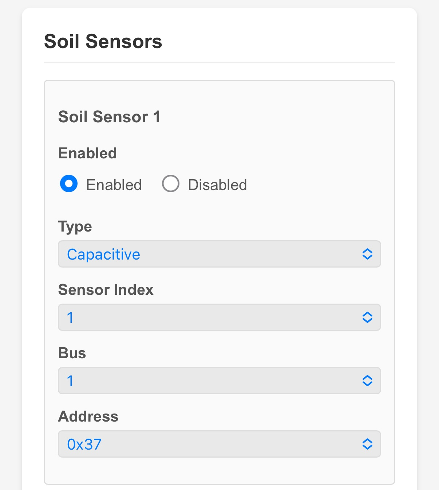
*The Soil Sensor configuration section. For the base kit, these defaults are correct and do not need to be changed.*

| Field | What to Set | Description |
|-------|-------------|-------------|
| **Enabled** | Yes | The sensor must be enabled to appear on the Dashboard. |
| **Type** | Capacitive | Must match the physical sensor you have plugged in. |
| **Sensor Index** | `1` | The identifier used to pair this sensor with a pump. |
| **Bus** | `1` | Set to match the Qwiic port you plugged the sensor into. Qwiic 1 = Bus 1. |
| **I2C Address** | `0x37` | Leave at the default for the standard capacitive sensor. |

#### Using a Different Soil Sensor

The AgXRP is designed for the capacitive sensor included in the base kit, but it also supports **resistive soil sensors** — a different type of analog soil sensor available from SparkFun. Resistive sensors report moisture as a percentage (0–100%) rather than in picofarads. If you switch to a resistive sensor, change the **Type** field in the soil sensor configuration from "Capacitive" to "Resistive," and be aware that any thresholds you have configured for automatic watering will also need to be updated to match the new unit.

---

### Additional Sensors

!!! note "These sensors do not come with the base kit"
    The sensors in this section are optional add-ons that can be purchased separately from SparkFun. If you only have the base kit, you can skip this section for now and come back when you add new hardware.

The AgXRP supports three types of additional sensors, all of which connect to the Qwiic ports just like the soil sensor.

To enable any of these sensors, go to the **Configuration page** and find the section for that sensor type. Enable the sensor and select which bus (Qwiic port) it is connected to.

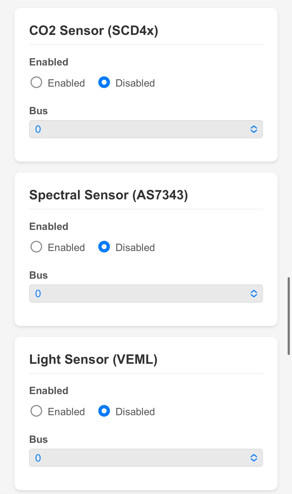
*The additional sensor sections on the Configuration page. Each one has an Enabled toggle and a Bus selector.*

#### CO2 Sensor (SCD4x)

This sensor measures three things simultaneously: **carbon dioxide concentration** (in parts per million, ppm), **air temperature** (in °C), and **relative humidity** (%). Carbon dioxide levels around plants can be a useful indicator of photosynthesis and respiration activity. Once enabled, temperature, humidity, and CO2 readings will all appear on the Dashboard.

#### Spectral Sensor (AS7343)

This sensor measures light broken down into individual color channels: **blue**, **green**, **red**, and **near-infrared (NIR)**. This is useful for studying how different wavelengths of light affect plant growth, since plants primarily use blue and red light for photosynthesis.

#### Light Sensor (VEML)

This sensor measures overall **ambient light intensity** in lux — a single number that represents the total brightness of the environment. This is simpler than the spectral sensor and useful when you just need to know how bright it is without caring about specific colors.

---

### OLED Screen

!!! note "The OLED screen does not come with the base kit"
    An OLED display is an optional accessory available from SparkFun. You do not need one to use the AgXRP.

An OLED screen is a small display that you can attach to one of the Qwiic ports. When connected and enabled, it shows live sensor readings directly on the board — no phone, tablet, or laptop required. This is useful when the AgXRP is deployed somewhere where you want a quick at-a-glance readout without pulling out your phone.

To enable the OLED screen, go to the **Configuration page** and find the **OLED Screen** section. Toggle it to **Enabled** and set the **Bus** to match the Qwiic port it is connected to.

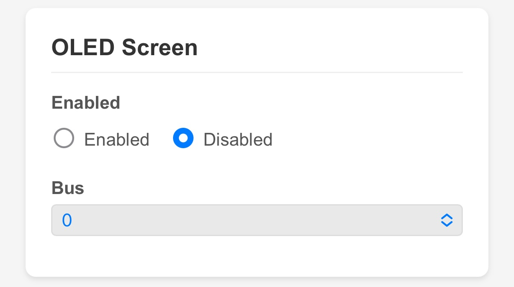
*The OLED Screen configuration section.*

---

## Pumps and Water Control

### Pumps

#### What Kind of Pump Is It?

The AgXRP uses a **peristaltic pump** — a type of pump that works by squeezing a flexible tube rhythmically, pushing liquid through it in one direction. Peristaltic pumps are ideal for plant watering because they are gentle, self-priming (eventually), and easy to control precisely.

The base kit comes with **one peristaltic pump**. The AgXRP software supports up to **four pumps** total (connected to Motor L, Motor R, Motor 3, and Motor 4 on the XRP board). Additional pumps can be added if you expand your kit.

#### Priming the Pump

When the pump is new or has been sitting unused, the tube may be empty and the pump may need to be **primed** — that is, run long enough to draw water up from the reservoir and through the full length of tubing before water actually comes out at the plant end.

To prime the pump, use the **manual pump controls** on the Dashboard (described in the next section). Run the pump for 10–30 seconds and check whether water is flowing. Repeat until water is consistently flowing out of the tube.

#### Configuring a Pump

Pump settings are found on the **Configuration page** in the **Pumps** section.

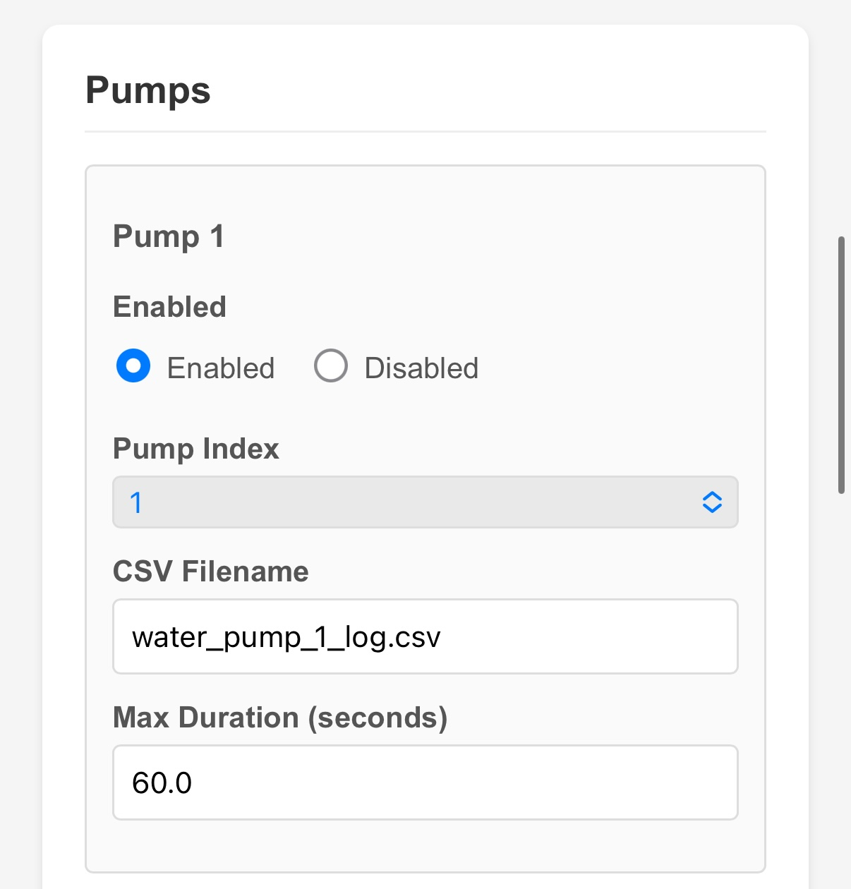
*The Pump configuration section. Each pump that is enabled will appear on the Dashboard.*

| Field | Description |
|-------|-------------|
| **Enabled** | The pump must be enabled to appear on the Dashboard. |
| **CSV Filename** | The name of the log file for this pump's watering events. Each pump gets its own log file (e.g., `water_pump_1_log.csv`). Leave blank to disable pump logging. |
| **Max Duration (seconds)** | A safety limit. Even if the automatic controller or a manual command tells the pump to run longer than this, it will stop automatically at this time. This prevents accidental flooding if something goes wrong. The default is 60 seconds. |

#### Manual Pump Controls on the Dashboard

The Dashboard has a **Manual Pump Controls** section that lets you run a pump directly from your browser.

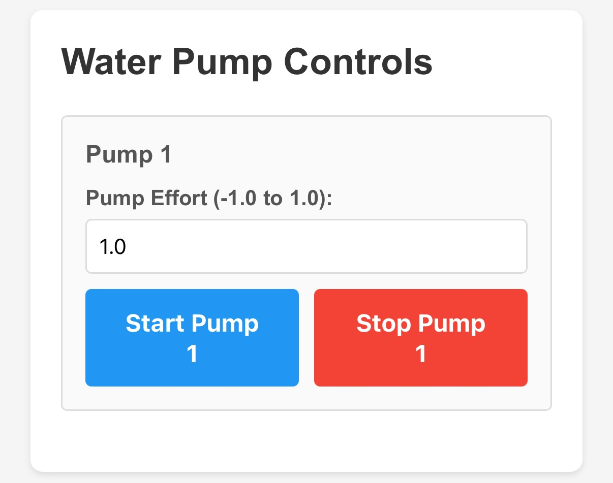
*The Manual Pump Controls section on the Dashboard.*

| Control | Description |
|---------|-------------|
| **Pump Effort** | A number between `-1.0` and `1.0` that controls the pump's speed and direction. `1.0` = full speed forward. `0.5` = half speed forward. `0.0` = stopped. Negative values (e.g., `-1.0`) run the pump **backwards**, which can be useful if the pump was installed in reverse and is pushing water the wrong way. |
| **Log this run** | A toggle that controls whether this manual pump run is recorded in the pump's log file. Turn this **off** when priming the pump so that priming runs do not appear in your watering data. Turn it **on** if you want to record a manual watering event. |
| **Start Pump** | Starts the pump at the effort level you entered. |
| **Stop Pump** | Stops the pump immediately. |

!!! tip "Verifying That Your Sensor and Pump Are Connected Correctly"
    When you start a pump manually, the **blue LED** on the soil moisture sensor that is paired with that pump will light up. If the LED on your sensor turns on when you click Start Pump, the sensor and pump are paired correctly. If no LED lights up, or the wrong sensor lights up, check the Plant System configuration (covered in the next section) to make sure the sensor index and pump are paired correctly.

---

### Automatic Water Control

The **automatic watering system** is what makes the AgXRP truly useful for plant experiments. Rather than watering plants manually on a schedule, the system continuously monitors the soil and waters automatically whenever the soil gets too dry.

#### What Is a Plant System?

The automatic watering controller is organized around the concept of a **Plant System**. Each Plant System pairs one soil sensor with one pump. The sensor monitors the soil, and when the reading drops below a threshold you set, the pump runs.

With the base kit, you have one Plant System: **Soil Sensor 1 paired with Pump 1 (Motor L)**.

An important thing to understand about how pumps are assigned: **the pump in a Plant System is determined by the Plant System's position**, not a number you type in a box. Plant System 1 always controls Pump 1 (Motor L). If you add Plant System 2, it will always control Pump 2 (Motor R), and so on. What you *do* choose is which **soil sensor index** feeds into each Plant System — that is, which sensor the system listens to when deciding whether to water.

#### Configuring Automatic Watering from the Dashboard

The bottom section of the Dashboard lets you configure the automatic watering settings for each Plant System without going to the Configuration page.

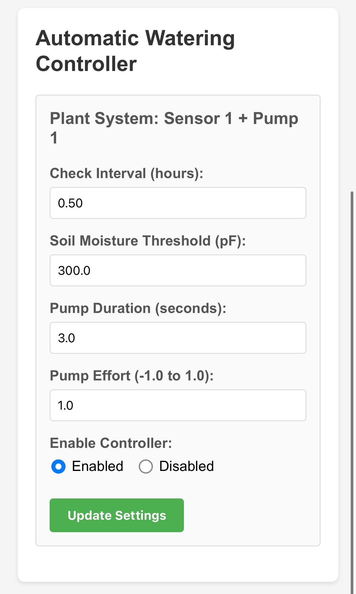
*The Automatic Watering Controller section on the Dashboard.*

| Field | Description |
|-------|-------------|
| **Check Interval (hours)** | How often the system checks the soil moisture. `0.5` = every 30 minutes. `1.0` = every hour. |
| **Soil Moisture Threshold** | The moisture level (in pF for capacitive sensors) below which the pump will activate. If the sensor reads lower than this number, the soil is considered too dry. |
| **Pump Duration (seconds)** | How long the pump runs each time it is triggered. |
| **Pump Effort (-1.0 to 1.0)** | The motor speed used during automatic watering. Typically `1.0` for full speed. |
| **Enable Controller** | Enables or disables automatic watering for this Plant System. You can disable it without changing any other settings. |

Click **Update Settings** after making any changes. Settings take effect immediately — no reboot needed.

#### How the Automatic Watering Loop Works

Here is what happens behind the scenes, step by step:

1. At the interval you set (for example, every 30 minutes), the board reads the soil moisture from the paired sensor.
2. If the moisture reading is **below the threshold**, the system flags that plant as needing water and activates the pump for the duration you configured.
3. The pump runs, adding water to the soil.
4. The system waits for the next check interval and reads the sensor again.
5. This cycle repeats continuously.

#### Understanding Hysteresis

There is one more concept that makes the automatic watering system smarter: **hysteresis**.

Imagine the threshold is set to 300 pF. Without hysteresis, the system might turn the pump on and off rapidly if the soil moisture is hovering right around 300 — one reading is 299 (pump on), the next is 301 (pump off), the next is 298 (pump on again). This rapid cycling is hard on the pump and is not good for the plants.

Hysteresis solves this by creating a **buffer zone**. Once the soil drops below the threshold and the system flags the plant as needing water, it does not stop flagging it as needing water until the moisture rises **above the threshold *plus* the hysteresis value**.

For example, with a threshold of 300 pF and a hysteresis of 20 pF:
- Pump activates when moisture drops **below 300 pF**
- Pump stops being triggered only after moisture rises **above 320 pF**

This prevents rapid cycling and ensures the soil gets meaningfully watered before the system considers the job done.

Hysteresis is configured on the **Configuration page** in the **Plant Systems** section.

#### Configuring Plant Systems on the Configuration Page

For more detailed settings, go to the **Configuration page** and find the **Plant Systems** section. This is also where you pair a specific soil sensor to a specific Plant System.

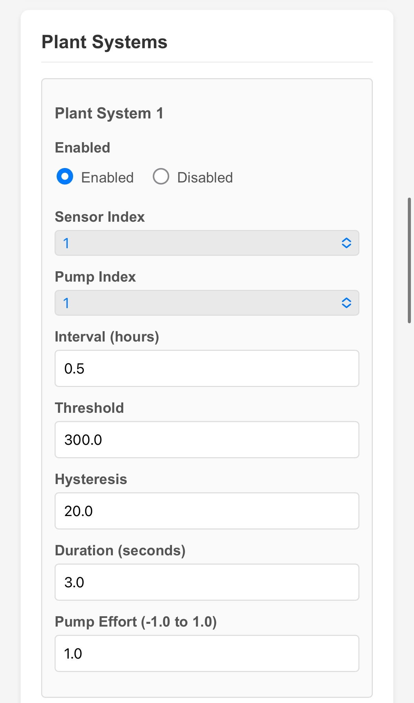
*The Plant System configuration section on the Configuration page.*

| Field | Description |
|-------|-------------|
| **Enabled** | Enables or disables this Plant System. |
| **Soil Sensor Index** | Which soil sensor this Plant System listens to. Set this to match the **Sensor Index** you assigned to the soil sensor in the Soil Sensors section. For the base kit, both should be `1`. |
| **Interval (hours)** | How often to check the soil. Same as Check Interval on the Dashboard. |
| **Threshold** | Moisture level below which watering is triggered. Same as on the Dashboard. |
| **Hysteresis** | The buffer above the threshold the moisture must reach before the system stops flagging the plant as needing water. |
| **Duration (seconds)** | How long the pump runs per watering event. |
| **Pump Effort (-1.0 to 1.0)** | Speed of the pump during automatic watering. |

!!! tip "How to Verify the Soil Sensor and Pump Are Paired Correctly"
    After configuring a Plant System, go back to the Dashboard and manually start the pump. If the **blue LED** on the soil sensor that you assigned to that Plant System lights up, the pairing is correct. If the wrong sensor's LED lights up — or no LED lights up at all — double-check that the **Sensor Index** in the Soil Sensors section matches the **Soil Sensor Index** in the Plant Systems section.

#### Enabling the Controller Globally

There is also a global **Controller** toggle on the Configuration page that enables or disables the entire automatic watering system at once. If this is disabled, no Plant Systems will run automatically — even if the individual Plant Systems are set to Enabled.

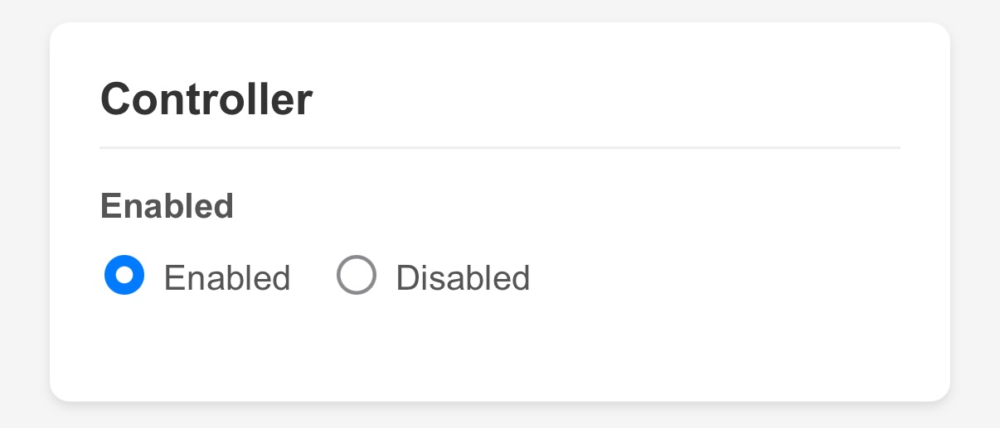
*The global Controller enable/disable toggle. This must be Enabled for any automatic watering to occur.*

This is useful if you want to temporarily pause all automatic watering without changing your individual Plant System settings.

!!! warning "Save and Reboot After Changing Configuration"
    Changes made on the **Configuration page** (including Plant System settings) require a save and reboot to take effect. Changes made directly on the **Dashboard** (Check Interval, Threshold, Duration, Effort, and Enable/Disable) take effect immediately without a reboot.

---

## Data and Timestamps

### The Data Page

The Data page lets you view and download the log files stored on the board. Navigate to **http://192.168.4.1/data** or click **Data** in the navigation bar.

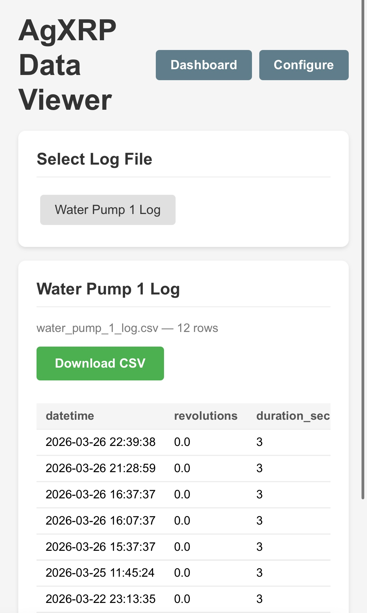
*The Data Viewer page. Click a filename to load and view its data.*

Two types of log files may be available:

- **Sensor Log** (`sensor_log.csv` by default) — Contains timestamped readings from all enabled sensors. This file is only created if you enabled the CSV Logger on the Configuration page.
- **Pump Logs** (e.g., `water_pump_1_log.csv`) — One file per pump, recording each watering event. Each row includes the timestamp, how long the pump ran, and the soil moisture reading at the time of watering.

Click a filename to display its contents as a table in your browser. The most recent entries appear at the top. Click the green **Download CSV** button to save the file to your device, where you can open it in Excel or Google Sheets for further analysis.

!!! note
    If no log files appear, make sure CSV logging is enabled on the Configuration page and that the board has been running long enough to collect some data.

### How Timestamps Work

Every row in a log file is stamped with the date and time it was recorded. But the XRP board does not have a battery-backed clock — meaning every time it loses power and restarts, its clock resets to a default date.

The AgXRP uses two methods to recover the correct time:

**1. Browser sync (most accurate)**
As soon as any phone, tablet, or laptop connects to the Dashboard in a web browser, the board automatically syncs its clock to the date and time on that device. From that moment forward, all new log entries will have accurate timestamps. This is the primary method and it happens automatically — you do not need to do anything.

**2. Log file recovery (approximate)**
If the board restarts and no browser has connected yet, the system looks through any existing log files for the most recent timestamp and sets its clock to that time. This is not perfectly accurate — it only tells the board what time it was the last time something was logged — but it keeps timestamps roughly in order until a browser syncs the clock properly.

#### What Happens During a Power Outage

!!! warning "Power Outages and Timestamps"
    If your AgXRP loses power and restarts, its clock resets. Here is what to expect:

    1. If CSV logging is enabled, the board will try to recover the time from the last log entry — but this may be hours behind the actual current time.
    2. Any data logged between the restart and your first browser connection will have timestamps based on the recovered (approximate) time, not the actual current time.
    3. Once you connect to the Dashboard from any device with a browser, the clock syncs immediately and all future log entries will have accurate timestamps.

    **The fix is simple:** after any power outage, open the Dashboard in your browser as soon as possible. The clock will sync automatically.

    If timestamp accuracy is critical for your experiment, consider connecting to the Dashboard briefly each day, or whenever the board restarts after a power interruption.

---

## Next Steps

- Proceed to [Tutorial 4 — Pump Calibration](tutorial-4-pump-calibration.md) to calibrate your water pump. *(Required for base kit)*
- Proceed to [Tutorial 5 — Moisture Sensor Calibration](tutorial-5-moisture-sensor-calibration.md) to find the right moisture threshold for your soil. *(Required for base kit)*
- Proceed to [Tutorial 3 — Additional Sensors & Pumps](tutorial-3-additional-sensors-and-pumps.md) if you want to add more sensors or pumps. *(Optional — expansion only)*
