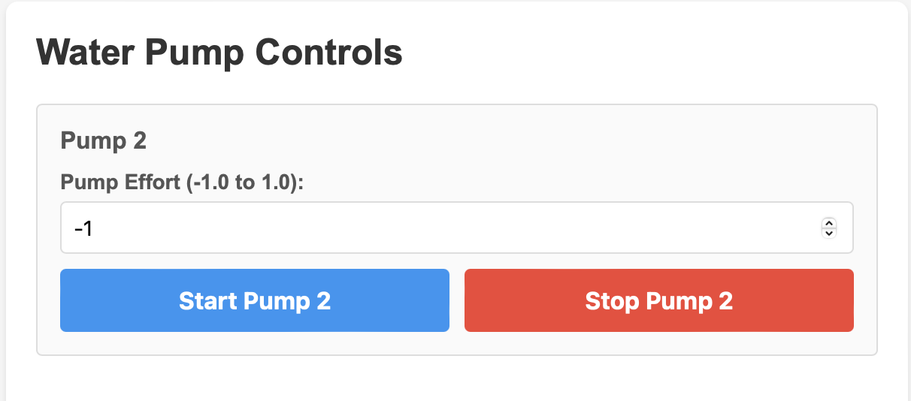

# Tutorial 4 — Pump Calibration

Before the pumps can operate, each tube must be **primed** — meaning the tube must already be filled with water so the peristaltic motor can push it through. This tutorial walks you through priming and testing each pump.

!!! note "Before You Begin"
    Make sure you have completed [Tutorial 1 — Kit Contents, Assembly & Wiring](tutorial-1-software-setup.md) and [Tutorial 2 — Dashboard & Configuration](tutorial-2-dashboard-and-configuration.md), and that the AgXRP web interface is accessible on your device.

## What You'll Need

| Component | Quantity | Notes |
|-----------|----------|-------|
| Water bottle | 1 per pump | Any bottle that fits in the 3D-printed holder |
| Silicone tubing | 1 per pump | Included with the pump kit |
| Funnel | 1 | For priming the tubing |
| Catch container | 1 | Cup or bowl to catch water during calibration |
| 3D-printed Velcro bottle holder | 1 per pump | Included with the AgXRP kit |

---

## Steps

**Step 1.** Fill a bottle with water and set it aside.

---

**Step 2.** Prime the tubing by running water through it from end to end (a sink works well). The entire inside of the tube must be wet before inserting it into the pump.

- Using a funnel is recommended to direct water inside the tube rather than over the outside.

!!! important
    If the tube is not fully primed with water, the motor will not be able to push water through it.

*Image 17 — Priming the tube using a funnel at a sink*

---

**Step 3.** Insert the tube into the AgXRP pump housing.

- Gently lift the gears slightly to create clearance.
- Press the tube around the inside edge of the pump housing, seating it fully into place.
    - Make sure the tube extends an even length on both sides of the pump.

*Image 18 — Inserting the tube into the AgXRP pump housing*

---

**Step 4.** Place one end of the tube into the water bottle. Place the other end into a separate container to catch runoff during calibration.

*Image 19 — Inserting the tube into its proper container for calibration*

---

**Step 5.** In the AgXRP web interface, set the **Pump Effort** to `0.5` (50% speed is a good starting point for calibration) and click **Start Pump**.

- If water flows in the wrong direction, set the **Pump Effort** to a negative value (e.g., `-0.5`) and click **Start Pump** again.

*Image 20 — Setting Water Pump Controls on web interface*

---

**Step 6.** Confirm that water is flowing steadily through the tube and into the catch container.

- Allow the pump to run for **10–15 seconds** to verify consistent flow.
- If the pump struggles to draw water up, tilt the water bottle so water flows more easily toward the tube inlet.
- Once confirmed, click **Stop Pump**.

*Image 21 — Water flowing through the pump tube during calibration*

---

**Step 7.** Once water flows consistently, secure the water bottle in the 3D-printed Velcro holder.

---

**Step 8.** If you have additional pumps, repeat all steps above for each pump.

*Image 22 — Full water pump system set-up (bottle in the 3D-printed Velcro holder)*

---

## Next Steps

- Proceed to [Tutorial 5 — Moisture Sensor Calibration](tutorial-5-moisture-sensor-calibration.md) to calibrate your moisture sensors for your specific soil and pots.
- You will need dry soil for the next tutorial — see [Appendix ii](appendix-ii-soil-drying.md) if you need to dry your soil first.
