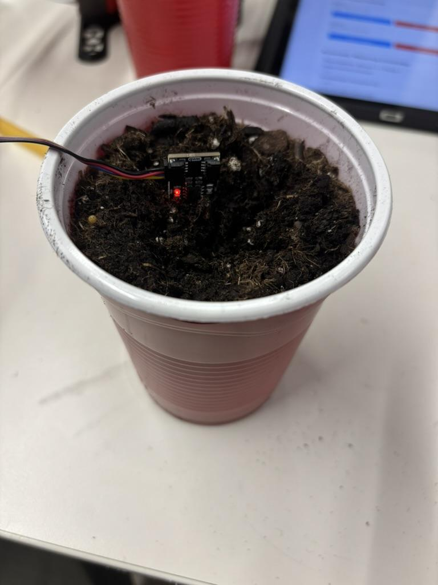
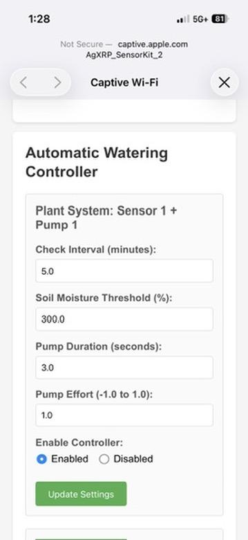

# Tutorial 5 — Moisture Sensor Calibration

This calibration procedure determines the correct **Soil Moisture Threshold** for your specific plant and pot. The threshold tells the automatic watering system when the soil is too dry and needs water. Complete this once before starting any plant experiment.

!!! note "Before You Begin"
    Make sure your potting soil is completely dry before starting. See [Appendix i](appendix-i-soil-drying.md) for instructions on drying soil. You should also have the AgXRP web interface running and accessible (see [Tutorial 2](tutorial-2-dashboard-and-configuration.md)).

## What You'll Need

| Component | Quantity | Notes |
|-----------|----------|-------|
| Gardening pot | 1 | Know its volume in cubic inches or milliliters |
| Dry potting soil | Enough to fill the pot | See [Appendix i](appendix-i-soil-drying.md) |
| Measuring cup or graduated cylinder | 1 | For measuring water |
| Moisture sensor (connected to AgXRP) | 1 | Already set up in Tutorial 1 |

---

## Steps

**Step 1.** Fill a gardening pot to the top with dry potting soil. Note the pot's volume before adding soil — this is usually printed on the pot or can be found from the manufacturer.

---

**Step 2.** Insert the moisture sensor into the dry soil, pushing it in until the sensing area is fully submerged. Record the moisture reading shown on the AgXRP Dashboard — this is your **dry baseline** reading. Then remove the sensor.

---

**Step 3.** Calculate 10% of the pot's volume in milliliters and measure out that amount of water.

!!! info "Unit Conversion"
    **1 cubic inch (in³) = 16.4 mL**

    Example: A 100 in³ pot holds 1,640 mL total — add 164 mL of water (10%).

---

**Step 4.** Pour the water evenly across the top of the soil. Wait **30–60 minutes** for it to absorb fully throughout the pot.

---

**Step 5.** Insert the moisture sensor back into the soil (at approximately the same depth as before) and record the new moisture reading. This value is your **Soil Moisture Threshold** — the level below which the system should trigger watering.

*Moisture sensor inserted into calibrated soil*

---

**Step 6.** In the web interface, go to the **Automatic Watering Controller** section on the Dashboard. Enter the value you just recorded in the **Soil Moisture Threshold** field and click **Update Settings**.

*Updating the Soil Moisture Threshold in the web interface*

---

**Step 7.** Allow the system to run and verify the results.

- Monitor the sensor readings to confirm the automation is triggering correctly.
- After the pump runs for the first time, wait an additional **15–30 minutes** and check the moisture reading again.
- If the reading is significantly above or below your target, adjust the settings as needed:
    - **Check Interval** — change how often the sensor checks moisture.
    - **Pump Duration** — increase to deliver more water per cycle, decrease to deliver less.
    - **Pump Effort** — adjust motor speed for more or less water flow per second.

---

!!! success "Calibration complete!"
    You are now ready to begin your plant experiment. Proceed to [Tutorial 6 — Plant Experiment](tutorial-6-plant-experiment.md).
